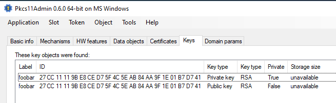

# PkcsEncDecRun - PKCS#11 Encryption & Decryption and Running of Encrypted Commands

Encrypt/decrypt strings using a PKCS#11 smartcard _and_ runs the encrypted command string.

## Requirements

- PKCS#11 compatible smartcard.
  - For compatbile smartcards see [Pkcs11Interop library](https://github.com/Pkcs11Interop/Pkcs11Interop#overview).
- RSA encryption key on smartcard.

## Usage

1. Prepare: acquire neccessary information.

   1. Insert your smartcard (token).
   2. Determine the serial number of the token.
      - run `PkcsEncDecRun.exe info x` - it displays the token's serial number.
      - or use [Pkcs11Admin](https://www.pkcs11admin.net/):
        
   3. Determine the **ID** of a **RSA** encryption key.
      - run `PkcsEncDecRun.exe info x` - it displays suitable keys and its IDs.
      - or use [Pkcs11Admin](https://www.pkcs11admin.net/):
        
   4. Adjust `PkcsEncDecRun.exe.config`.
      - 

2. Encrypt your command (test it first!) and its arguments; arguments must be delimited by "`|~|`".

   ```
   PkcsEncDecRun.exe enc "c:\Programs\mypgrogram.exe|~|e:\mytresor"
   ```

   This generates a base64-encoded, encrypted string (encrypted with the RSA public key from the smartcard).

3. Run or create a batch file (or similar):

   ```
   PkcsEncDecRun.exe run yJH3+9nEz...
   ```

   This will first decrypt the string with the smartcard, and then it runs the command.

## PIN as Environment Variable

The PIN can be given in the environment variable `PKCS_PIN`.
**Be sure to clear that variable when done!**

Example:

```
set PKCS_PIN=0000
```

## Build

### Build Requirements

- MS Visual Studio 2015
- .NET 4.0+
- NuGet
  - [Pkcs11Interop](https://github.com/Pkcs11Interop/Pkcs11Interop)
  - [ILMerge](https://github.com/Microsoft/ILMerge)
  - [ConfuserEx](https://github.com/yck1509/ConfuserEx)

### Build

- Use MS Visual Studio IDE or msbuild
- The **Release**-postbuild produces an all-in-one file `ARTEFACT.all.exe` which includes all needed DLLs.
- The file `ARTEFACT.all.exe` is obfuscated using [ConfuserEx](https://github.com/yck1509/ConfuserEx).

## Tools

- [Pkcs11Admin](https://www.pkcs11admin.net)
- [SoftHSM](https://github.com/opendnssec/SoftHSMv2)
  - Hint: make sure the `softhsm2.conf` is in the same folder of `Pkcs11Admin-x64.exe` or `PkcsEncDecRun.exe`.

## Author

AST, 02/2018

## License

AGPL v3
